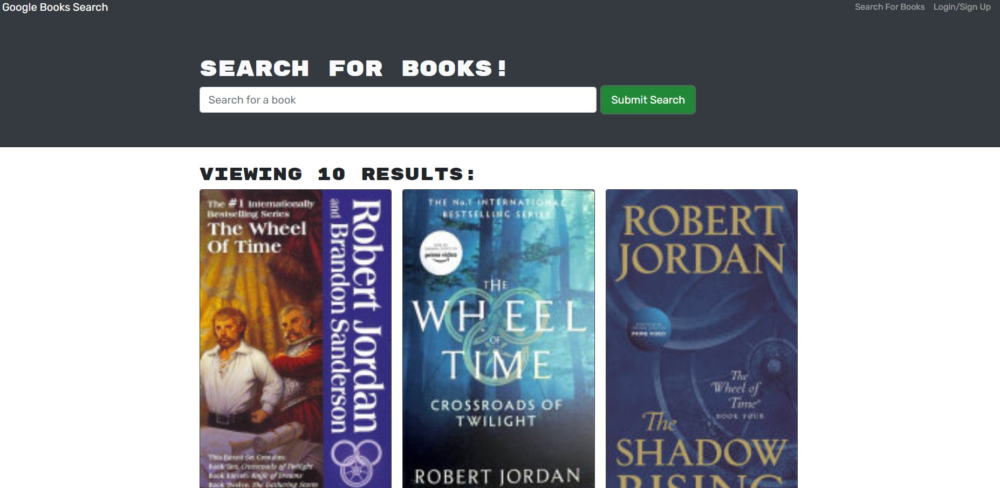
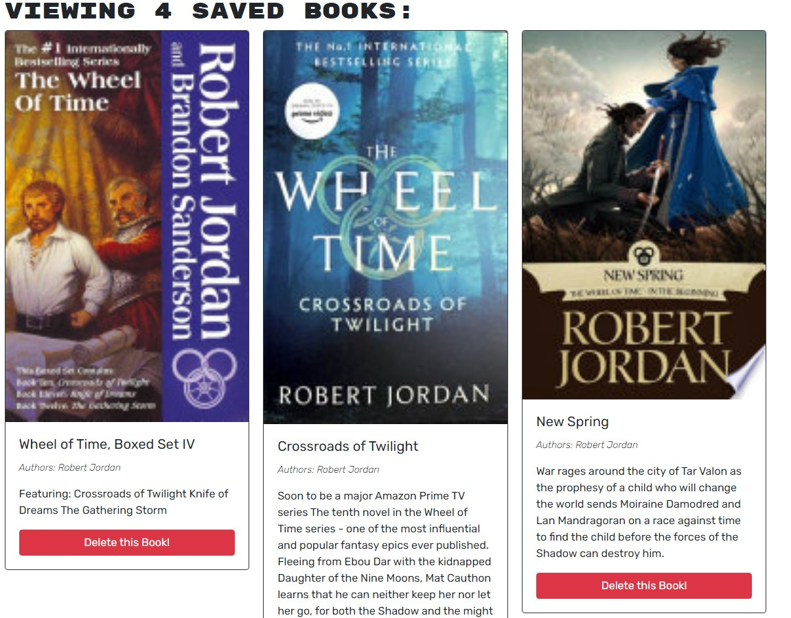

# MernBook

## Screenshots

  ## License
  
  ## Description
  This was originally a fully functioning mongoDB app that I have converted to use Mern and apollo/graphql. This allows you to log in, search up books, and then save books to your accounts so that you could make a reading list! You can even remove books from your profile if you read them, or decide that you don't like them.
  ## Table of Contents
- [MernBook](#mernbook)
	- [Screenshots](#screenshots)
	- [License](#license)
	- [Description](#description)
	- [Table of Contents](#table-of-contents)
	- [Installation](#installation)
	- [Usage](#usage)
	- [Contributions](#contributions)
	- [Test Instructions](#test-instructions)
	- [Contact](#contact)
  ## Installation
  if you wanna install this go to my github repo and clone the repo: https://github.com/Ikomeda/mernbook
  ## Usage
  Go to the deployed app on Heroku to search books, and login to save/delete them from your account.
  ## Contributions
  n/a
  ## Test Instructions
  n/a
  ## Contact
  * GitHub: https://github.com/Ikomeda/
  * Email: n/a